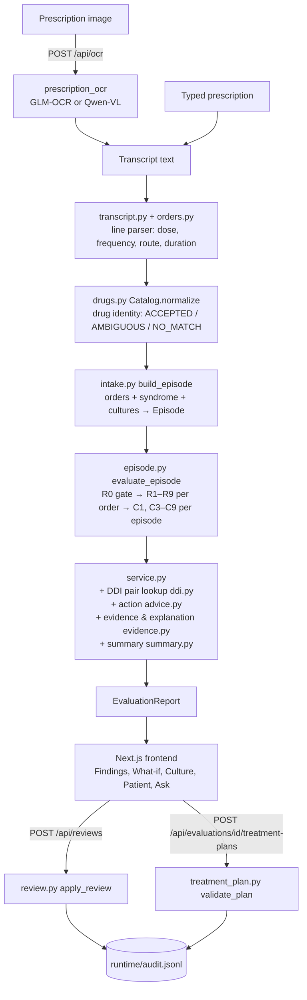
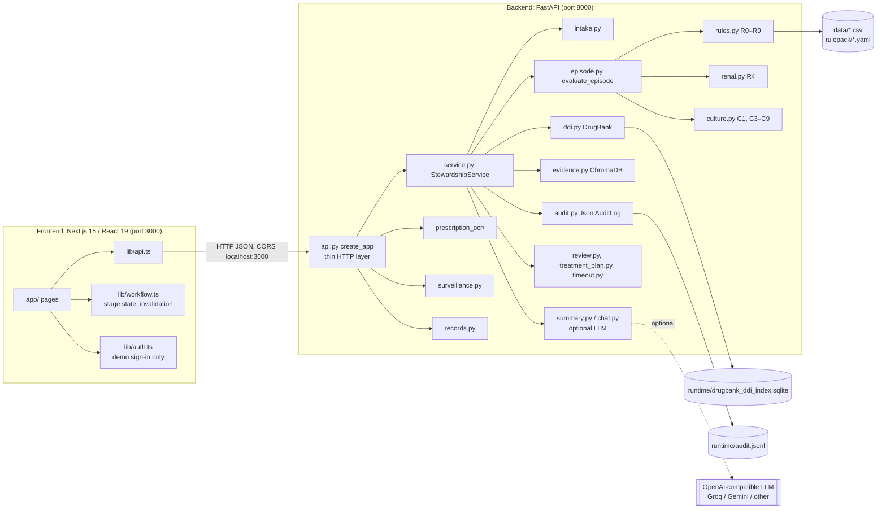
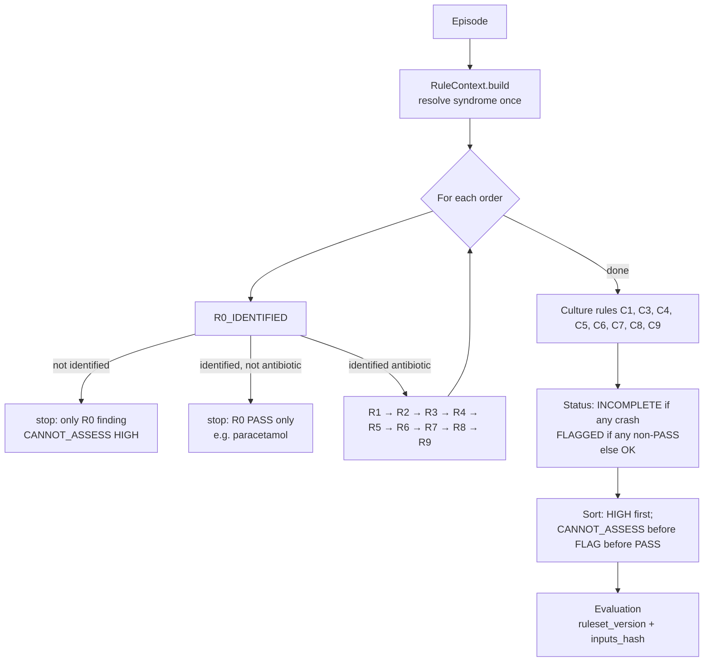
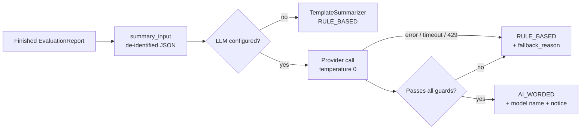
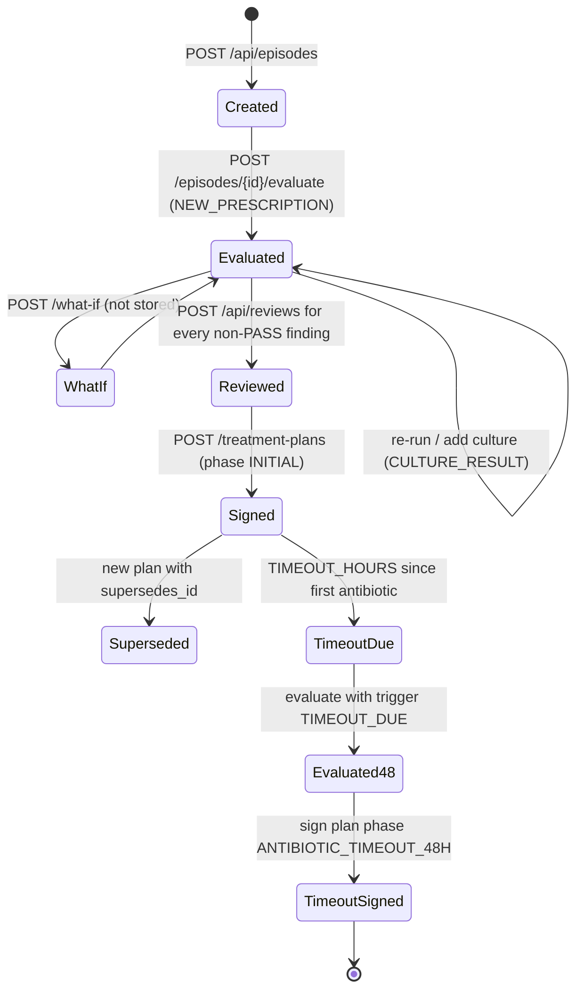

# Project Presentation Guide: Antibiotic Stewardship Copilot (HC-03)

A study guide for presenting the project and answering questions about it. Everything here was
checked against the repository on **2026-10-09** (branch `typed-rx-mvp`, including uncommitted
working-tree changes). Where the repository could not confirm something, the guide says so with a
**⚠ Not verified** or **⚠ Inconsistency** marker.

How to read it: each section opens with a plain-language explanation, then gives the technical
detail (file names, function names, endpoints, numbers).

---

## Table of contents

1. [Project overview](#1-project-overview)
2. [Complete workflow](#2-complete-workflow)
3. [Architecture](#3-architecture)
4. [Rule engine](#4-rule-engine)
5. [AI / LLM integration](#5-ai--llm-integration)
6. [Data and sources](#6-data-and-sources)
7. [Prescription input and OCR](#7-prescription-input-and-ocr)
8. [Database and data flow](#8-database-and-data-flow)
9. [Testing and validation](#9-testing-and-validation)
10. [Frontend walkthrough](#10-frontend-walkthrough)
11. [Setup and demo](#11-setup-and-demo)
12. [Limitations and future improvements](#12-limitations-and-future-improvements)
13. [Presentation script](#13-presentation-script)
14. [Questions and answers](#14-questions-and-answers)
15. [Quick revision sheet](#15-quick-revision-sheet)

---

## 1. Project overview

### In plain words

Antibiotics stop working when they are overused or used wrongly; bacteria become resistant
(antimicrobial resistance, **AMR**). Hospitals run **antibiotic stewardship** programmes: a
pharmacist or infectious-disease team checks whether each antibiotic prescription is the right
drug, dose and duration, and whether lab culture results support it.

That checking is slow and manual. Our project, the **Antibiotic Stewardship Copilot**, does the
checking automatically and shows the pharmacist what to look at. **The pharmacist still makes every
decision.**

### Problem statement (HC-03)

From `docs/CORE_SPEC.md` §0: *"check antibiotic prescriptions against guidelines and local
resistance, flag wrong drug / dose / duration / no culture, suggest safer options **for pharmacist
approval**."*

### Motivation

- Wrong antibiotic choices (for example a broad-spectrum "Watch" drug where a narrower "Access"
  drug would do) drive resistance.
- Indian prescriptions are often handwritten and use brand names, so even reading them is a task.
- Guidelines exist (NCDC 2025, ICMR), but nobody can hold all of them in their head for every
  prescription.

### Objectives

1. Read a prescription (typed, or a photo through OCR) into structured drug orders.
2. Check every antibiotic order against the Indian national guideline, the patient's kidney
   function, allergies, pregnancy status, comorbidities and culture results.
3. Never guess: anything that cannot be checked is reported as `CANNOT_ASSESS`, never as a pass.
4. Cite a source for every result.
5. Let the pharmacist record a decision on each finding and sign a final treatment plan, with
   an audit trail.

### Target users

- **Primary:** the hospital stewardship pharmacist who reviews antibiotic orders.
- **Secondary:** the prescribing doctor (the demo login includes a physician account), and the
  stewardship team reviewing time-outs and dashboards.

### Our solution in one sentence

A **deterministic rule engine** (Python, FastAPI) checks each antibiotic order against cited
guideline and drug data and returns PASS / FLAG / CANNOT_ASSESS findings. A **Next.js** web app
walks the pharmacist through five stages, from prescription to signed plan. An **optional language
model** only rewords the results and answers questions about them. It never decides anything.

The README's own summary (`README.md`): *"Every check is deterministic and cites its source;
anything it cannot check is reported as `CANNOT_ASSESS`, never as a pass. No model makes a clinical
decision."*

---

## 2. Complete workflow

### In plain words

1. The pharmacist enters the prescription, typed or as a photo.
2. The system splits it into medicine lines and works out which drug each line names.
3. The pharmacist adds patient details (age, weight, creatinine, allergies) and any culture
   result, or fetches them from the (synthetic) hospital record.
4. The engine runs every check and produces findings.
5. Each finding gets a recommended action, its evidence, and a plain-language explanation.
6. The pharmacist approves, modifies or removes each finding.
7. The pharmacist signs a final treatment plan. Every decision goes into an audit log.
8. 48 hours after the first dose (configurable), the episode comes up for a **time-out** review.

### Pipeline diagram



### Step by step, with the code behind each step

| Step | What happens | Code |
|---|---|---|
| 1. Input | Typed text, or an image sent to OCR | `frontend/app/upload/page.tsx`; `POST /api/ocr`, `POST /api/parse-prescription` |
| 2. Header strip | Header lines (Age:, Diagnosis:, …) are dropped; if a `Rx` / `Prescription:` marker exists only lines after it are read | `intake.medicine_text()` |
| 3. Line parsing | Each line → dosage form, name, strength, frequency, route, duration | `prescription_ocr/transcript.py parse_prescription_lines()`, `prescription_ocr/orders.py build_order()` |
| 4. Drug identity | Name → generic, or AMBIGUOUS with candidates, or NO_MATCH | `backend/stewardship/drugs.py Catalog.normalize()` |
| 5. Diagnosis | "Diagnosis:" line read; mapped to a syndrome code only when unambiguous | `intake.diagnosis_line()`, `intake.read_diagnosis()`, `intake.resolve_syndrome()` |
| 6. Cultures | Validated and converted to `Specimen` objects; inconsistent input rejected (HTTP 422) | `intake.build_specimens()` |
| 7. Episode | One immutable `Episode` (patient, setting, syndrome, orders, specimens) | `intake.build_episode()`, `schemas.Episode` |
| 8. Rule analysis | R0 gate, R1–R9 per antibiotic order, C1/C3–C9 culture rules | `episode.evaluate_episode()`, `rules.py`, `renal.py`, `culture.py` |
| 9. DDI | Every pair of identified medications looked up in the local DrugBank index | `ddi.check_pairs()`, `DrugBankDDIProvider` |
| 10. Explain | Fixed-table action, retrieved guideline passages, template explanation, summary | `advice.action_for()`, `evidence.py`, `summary.py` |
| 11. Review | Pharmacist decision per finding, validated, appended to the audit log | `review.apply_review()`, `POST /api/reviews` |
| 12. Final plan | One disposition per antibiotic, validated, signed, audited | `treatment_plan.validate_plan()`, `service.sign_treatment_plan()` |
| 13. Time-out | Due once `TIMEOUT_HOURS` have passed since the first antibiotic start, until a 48-hour plan is signed | `timeout.is_timeout_due()`, `GET /api/timeouts` |

### The three possible outcomes of a check

| Outcome | Meaning | Example |
|---|---|---|
| `PASS` | The check ran and found nothing to flag | Daily dose within guideline range |
| `FLAG` | The check ran and found something the pharmacist should review | Watch drug used where an Access first-line exists |
| `CANNOT_ASSESS` | The check could not run (missing or out-of-scope input) | No creatinine, so renal dosing cannot be checked |

Severities: `INFO`, `LOW`, `MODERATE`, `HIGH`.

Evaluation status (`schemas.EvaluationStatus`):

- `OK`: every finding is PASS.
- `FLAGGED`: at least one FLAG or CANNOT_ASSESS.
- `INCOMPLETE`: at least one check crashed. The crash becomes a `CANNOT_ASSESS / HIGH` finding
  ("Check failed (…); result not available."), so a partial run never looks clean.

---

## 3. Architecture

### In plain words

There are two programs:

- the **backend** (Python), which holds all the clinical logic and data;
- the **frontend** (a website built with Next.js/React), which only displays results and sends the
  pharmacist's inputs.

They talk over HTTP with JSON. The frontend never makes a clinical decision.

### Component diagram



### Design principles (stated in the code)

- **Pure core.** `rules.py`, `culture.py`, `timeout.py`, `episode.py` do no I/O: inputs in,
  findings out (`docs/CORE_SPEC.md` §8).
- **Ports and adapters.** `ports.py` defines `typing.Protocol` interfaces (`DrugCatalog`,
  `RenalChecker`, `RulePack`, `CoverageEstimator`, `PatientRecordSource`). Real implementations
  (`Catalog`, `RenalDosing`, `YamlRulePack`, `JsonPatientRecords`) and test fakes
  (`backend/tests/fakes.py`) both plug in.
- **Thin API.** `api.py` docstring: *"No clinical logic lives here."*
- **One configuration module.** Every threshold and path is in `config.py` and can be overridden
  with an `HC03_*` environment variable.

### Folder structure

```
hacktopia-Antibioticstewardship/
├── backend/
│   ├── main.py                     # ASGI entry: app = create_app()
│   ├── stewardship/                # the application
│   │   ├── api.py                  # FastAPI routes (HTTP only)
│   │   ├── service.py              # orchestration: StewardshipService
│   │   ├── intake.py               # request → Episode (parsing, syndrome, cultures)
│   │   ├── episode.py              # evaluate_episode(): the engine entry point
│   │   ├── rules.py                # R0–R9 per-order rules
│   │   ├── renal.py                # R4 (Cockcroft-Gault + renal bands)
│   │   ├── culture.py              # C1, C3–C9 culture rules
│   │   ├── drugs.py                # Catalog: normalization, AWaRe, intrinsic resistance
│   │   ├── pregnancy.py            # R7 data loader
│   │   ├── drug_disease.py         # R8 data loader
│   │   ├── ddi.py                  # DrugBank drug-drug interaction lookup
│   │   ├── rulepack.py             # YamlRulePack (NCDC guideline data)
│   │   ├── rulepack/               # syndromes.yaml (13), syndromes_ncdc.yaml (93), ncdc_import.yaml
│   │   ├── ncdc_import.py          # logic behind scripts/import_ncdc.py
│   │   ├── advice.py               # fixed action text per (rule, outcome); culture summary
│   │   ├── evidence.py             # ChromaDB retrieval + TemplateExplainer
│   │   ├── summary.py              # rule-based or LLM-worded summary, with guards
│   │   ├── chat.py                 # "Ask about this result" (LLM, guarded)
│   │   ├── narrative.py            # plan narrative (template)
│   │   ├── treatment_plan.py       # final plan validation
│   │   ├── review.py               # review validation (apply_review)
│   │   ├── timeout.py              # 48-hour time-out logic
│   │   ├── audit.py                # append-only JSONL audit log
│   │   ├── records.py              # patient record lookup (synthetic JSON)
│   │   ├── surveillance.py         # ICMR AMRSN 2023 advisory susceptibility
│   │   ├── schemas.py              # Pydantic v2 models and enums
│   │   ├── ports.py                # Protocol interfaces
│   │   └── config.py               # thresholds, paths, env vars, .env loader
│   └── tests/                      # pytest suite (517 tests)
├── prescription_ocr/               # image → transcript → DrugOrders (GLM-OCR, Qwen-VL)
├── frontend/                       # Next.js app
│   ├── app/                        # pages: upload, episode/new, evaluation/[id], plan, dashboard, culture, audit, timeout, login
│   ├── components/                 # layout/, stewardship/, ui/
│   ├── lib/                        # api.ts, workflow.ts, auth.ts, mock-data.ts
│   └── types/stewardship.ts        # TypeScript mirror of backend models
├── data/                           # catalogs, renal table, AWaRe, reference sources, demo cases
├── scripts/                        # data builders and evaluation scripts
├── docs/                           # APPLICATION, CORE_SPEC, RULEPACK, SOURCES, OCR test, NCDC import report
├── legacy/                         # superseded RxGuard pipeline (not used)
├── runtime/                        # gitignored: audit.jsonl, DrugBank SQLite index
├── requirements-core.txt, requirements-api.txt, requirements-ocr.txt
└── pyproject.toml                  # ruff + pytest config
```

### API endpoints (all in `backend/stewardship/api.py`)

| Method | Path | Purpose |
|---|---|---|
| GET | `/api/health` | `{"status": "ok", "ruleset_version": ...}` |
| GET | `/api/stats` | Dashboard numbers (`DashboardStats`) |
| POST | `/api/ocr?engine=glm\|qwen` | Upload image (JPEG/PNG/TIFF/WebP, ≤ 15 MB) → transcript + parsed drugs |
| GET | `/api/syndromes` | All rule-pack syndrome codes with NCDC section and page |
| GET | `/api/surveillance?generic=…&organism=…` | ICMR AMRSN 2023 susceptibility rows (advisory) |
| GET | `/api/patients/{patient_id}` | Pre-fill record (synthetic demo patients) |
| POST | `/api/parse-prescription` | Preview: text → orders, diagnosis, patient ID/name |
| POST | `/api/evaluate` | One call: request → `EvaluationReport` |
| GET | `/api/episodes?has_culture=` | List episodes |
| POST | `/api/episodes` | Create an episode |
| GET | `/api/episodes/{id}` | Get one episode |
| POST | `/api/episodes/{id}/evaluate?trigger=` | Evaluate (trigger e.g. `NEW_PRESCRIPTION`, `TIMEOUT_DUE`) |
| POST | `/api/episodes/{id}/cultures` | Add a later culture and re-evaluate (`CULTURE_RESULT`) |
| POST | `/api/episodes/{id}/what-if` | Re-evaluate with changed patient values; not stored |
| GET | `/api/evaluations/{id}` | Get a stored report |
| POST | `/api/evaluations/{id}/ask` | Question about the evaluation (LLM, guarded) |
| GET | `/api/evaluations/{id}/reviews` | Reviews recorded for it |
| GET | `/api/evaluations/{id}/treatment-plans` | All signed plans (newest first) |
| GET | `/api/evaluations/{id}/treatment-plan` | Latest signed plan |
| POST | `/api/evaluations/{id}/treatment-plans` | Sign a plan (201) |
| POST | `/api/reviews` | Record a pharmacist decision |
| GET | `/api/audit?entity_id=` | Read the audit log |
| GET | `/api/timeouts/config` | Time-out threshold in minutes, `demo_mode` if < 60 |
| GET | `/api/timeouts?status=all\|due\|completed` | Time-out queue |
| GET | `/api/timeout-due` | Only items with status `REVIEW_DUE` |

Error mapping: `IntakeError`, `ReviewError`, `PlanError` and Pydantic `ValidationError` → **422**;
`ConflictError` → **409**; `NotFoundError` → **404**; `ChatLimitError` → **429**; OCR: bad engine
422, bad file type 415, too large 413, model failure 503.

### How components communicate

- Frontend → backend: `fetch` calls in `frontend/lib/api.ts` to `NEXT_PUBLIC_API_URL`
  (default `http://localhost:8000`). Error bodies' `detail` text is shown to the user.
- CORS allows only `http://localhost:3000` and `http://127.0.0.1:3000`.
- `default_service()` in `api.py` wires the production objects: `Catalog.load()`, `YamlRulePack()`,
  `RenalDosing.load()`, `JsonlAuditLog(runtime/audit.jsonl)`, `build_store(pack)` (Chroma),
  `summarizer_from_env()`, `DrugBankDDIProvider()`.
- OCR models load lazily on the first `/api/ocr` call, behind a lock, in a thread pool.

---

## 4. Rule engine

### In plain words

The engine is a list of small checks. Each check looks at one thing (the dose, say) and answers
PASS, FLAG or CANNOT_ASSESS, with a message, a severity, its evidence, and sometimes a suggestion
("switch to X", "adjust dose"). The first check (R0) is a **gate**: if we are not sure which drug a
line names, no other check runs on it, because checking the wrong drug is worse than not checking.

### How `evaluate_episode()` works (`backend/stewardship/episode.py`)



Details:

- Each rule runs inside `collect()`. An exception becomes `CANNOT_ASSESS / HIGH`, is logged with
  `logger.exception`, and the status becomes `INCOMPLETE`.
- `inputs_hash` = SHA-256 of the episode JSON + rule-pack version + evaluation time.
  **⚠ Inconsistency:** `docs/CORE_SPEC.md` §7 says the hash is episode + version only. The code also
  includes `now`, so two runs at different times get different hashes. The *findings* are still
  deterministic for the same inputs and time.
- `ruleset_version` looks like `ncdc-ntg-2025:<12-char sha256>` of the YAML files (verified value
  today: `ncdc-ntg-2025:cef5e09f0078`), so every evaluation records exactly which guideline data
  it used.
- A `CoverageEstimator` hook exists, but no implementation is wired in (see §12).

### Per-order rules (`rules.py`, `renal.py`)

| Rule | What it checks (plain words) | Logic in the code | Outcomes |
|---|---|---|---|
| **R0_IDENTIFIED** | Do we know which drug this is? | `norm_status` must be `ACCEPTED` or `CONFIRMED` | PASS/INFO, or CANNOT_ASSESS/HIGH with `confirm_drug` suggestion and candidate list. All other rules skip the order. |
| **R1_INDICATION** | Is this drug recommended for the diagnosis? | No syndrome → CANNOT_ASSESS/MODERATE. Syndrome says no antibiotic → FLAG/HIGH `stop`. In first-line → PASS. In alternatives → PASS ("First-line is X"). Otherwise → FLAG/MODERATE `switch` to first first-line drug | Route not used |
| **R2_AWARE** | Is it a Reserve/Watch drug that needs justification? | Tier from `Catalog.aware_tier(generic, route)`. RESERVE → FLAG/HIGH (needs stewardship approval). WATCH **and** the syndrome has an Access first-line → FLAG/MODERATE `switch`. NOT_CLASSIFIED → CANNOT_ASSESS/LOW. Else PASS | WHO AWaRe 2025 cited |
| **R3_DOSE** | Is the daily dose in the guideline range? | Age < 18 → CANNOT_ASSESS. Dose or frequency missing → CANNOT_ASSESS. No syndrome → CANNOT_ASSESS. No regimen for **same drug and route** → CANNOT_ASSESS. Weight-based → CANNOT_ASSESS. `daily = dose_mg × freq_per_day`; above max → FLAG (HIGH if > 1.5 × max, else MODERATE); below min → FLAG/MODERATE | `HIGH_DOSE_FACTOR = 1.5` |
| **R4_RENAL** | Is it suitable for the patient's kidney function? | See "Renal dosing" below | Delegated to `RenalDosing.check()` |
| **R5_DURATION** | Is the planned course length right? | Missing → CANNOT_ASSESS/LOW. No syndrome / regimen / printed duration → CANNOT_ASSESS. Longer than max → FLAG/MODERATE; shorter than min → FLAG/LOW | `adjust_duration` |
| **R6_ALLERGY** | Does it clash with a documented allergy? | Status `UNKNOWN` → CANNOT_ASSESS (MODERATE for beta-lactams, LOW otherwise). Name or beta-lactam class match → FLAG/HIGH, suggesting the first guideline option without a match (any beta-lactam excluded for a beta-lactam allergy). Else PASS | Classes from name: `cillin` → penicillin, `cef`/`ceph` → cephalosporin, `penem` → carbapenem |
| **R7_PREGNANCY** | Is it avoided in pregnancy? | Drug not in `data/pregnancy_caution.csv` → PASS. Pregnant → FLAG/HIGH + safer guideline option. Pregnancy unrecorded for a woman aged 12–50 → CANNOT_ASSESS/LOW. Else PASS | 9 drugs listed (tetracyclines, tigecycline, …) |
| **R8_DRUG_DISEASE** | Does the label warn about the patient's conditions? | No comorbidities → PASS. Match in `data/drug_disease.csv` (FDA label sentence): Contraindication/Boxed Warning → FLAG/HIGH + option; Warning only → FLAG/MODERATE | Conditions: liver disease, seizure disorder, myasthenia gravis, QT prolongation, diabetes, G6PD deficiency, aortic aneurysm |
| **R9_IV_TO_ORAL** | After the time-out, can an IV drug switch to oral? | Not IV → PASS. IV for less than `TIMEOUT_HOURS` → PASS. No syndrome → CANNOT_ASSESS. Guideline lists an oral regimen (not allergy-matched) → FLAG/LOW `switch` (asks pharmacist to confirm stability and oral intake). Else PASS | Nothing is switched automatically |

Non-antibiotic orders (identified through `data/non_antibiotics.csv`, e.g. paracetamol,
pantoprazole) get only R0 PASS. No stewardship rule runs on them, but they do take part in DDI checks.

### Renal dosing (R4) in detail (`backend/stewardship/renal.py`)

**Plain words:** kidneys clear many antibiotics. If the kidneys are weak, the dose must come down or
the drug must be avoided. We estimate kidney function from age, weight, sex and blood creatinine.

**Formula (Cockcroft–Gault, 1976)** in `creatinine_clearance()`:

```
CrCl (mL/min) = (140 − age) × weight_kg / (72 × serum_creatinine_mg_dl)   × 0.85 if female
```

Actual body weight is used. Missing weight or creatinine → `None`.

**Bands** come from `data/renal_dosing.csv` (83 rows). Each row covers a drug, routes, a CrCl range
and one action:

| Action | Engine result |
|---|---|
| `none` | PASS |
| `adjust` with `max_daily_mg` | PASS if daily dose ≤ cap; FLAG (MODERATE, or HIGH if > 1.5 × cap) if above; CANNOT_ASSESS if dose/frequency missing |
| `adjust` without a cap | FLAG/MODERATE, quoting the source text |
| `avoid` | FLAG/HIGH, `switch` |
| `review` | FLAG/MODERATE: sources disagree, the pharmacist decides |

Order of checks: drug not in the table (or not for this route) → CANNOT_ASSESS/LOW; route missing
and bands differ by route → CANNOT_ASSESS; age < 18 → CANNOT_ASSESS; every band `none` → PASS
without needing creatinine; CrCl unknown → CANNOT_ASSESS naming `weight_kg` /
`serum_creatinine_mg_dl`; CrCl outside every band → CANNOT_ASSESS.

**Example (verified by running the demo case today):** SYN-DEMO-06, 72-year-old man, 60 kg,
creatinine 2.4 → CrCl ≈ 24 mL/min. Piperacillin-tazobactam 4.5 g q6h = 18,000 mg/day → *"Daily dose
18000 mg exceeds the renal limit of 13500 mg/day at estimated creatinine clearance 24 mL/min."*
(R4 FLAG MODERATE).

**Nitrofurantoin:** no Indian source gives a kidney threshold. The table combines the US FDA label
(contraindicated below CrCl 60) and the UK MHRA 2014 safety update (eGFR 45): `none` at ≥ 60,
`review` at 45–59, `avoid` below 45 (`data/reference/README.md`).

### Culture rules (`backend/stewardship/culture.py`)

**Plain words:** a culture is a lab test that grows the bacteria from a sample (urine, blood) and
tests which antibiotics kill it (S = susceptible, I = intermediate, R = resistant). Culture rules
compare that result with what the patient is getting.

Culture rules only speak when they apply: a rule that does not apply returns no finding at all.
"Active antibiotics" means identified antibiotic orders.

| Rule | Trigger | Result |
|---|---|---|
| **C1_CULTURE_BEFORE_WATCH** | Syndrome says culture required (only cystitis and pyelonephritis in the hand-checked pack), a Watch/Reserve drug is active, and no specimen other than `NOT_SENT` | FLAG/MODERATE `send_culture` |
| **C3_BUG_DRUG_MISMATCH** | FINAL, non-contaminant isolate tested **R** to an active drug, **or** intrinsically resistant (CLSI via AMRIE) | FLAG/HIGH "therapy is likely inactive", `switch` |
| **C4_DE_ESCALATE** | FINAL isolates; active drug is Watch/Reserve; a guideline Access drug, same route, not allergy-blocked, is **S** for every isolate and not intrinsically resistant | FLAG/MODERATE `switch` to the first such drug in rule-pack order |
| **C5_NO_GROWTH** | Specimen `NO_GROWTH` and ≥ `TIMEOUT_HOURS` since first antibiotic | FLAG/MODERATE `provide_input`: the clinician decides. Never suggests "stop" |
| **C6_CONTAMINANT** | Isolate marked `probable_contaminant` | FLAG/LOW; C3/C4 ignore that isolate |
| **C7_INTERMEDIATE** | Active drug tested **I** | FLAG/MODERATE, not treated as susceptible |
| **C8_NOT_TESTED** | FINAL isolate, active drug not on the panel and not intrinsic | CANNOT_ASSESS/MODERATE |
| **C9_ORGANISM_UNKNOWN** | Organism name not in AMRIE `Organisms.txt` (e.g. "E. coli" instead of "Escherichia coli") | CANNOT_ASSESS/MODERATE: intrinsic resistance not checked |

There is no **C2**; the numbering skips it (not explained in the repository).

Culture input states (`docs/APPLICATION.md`):

| Input | Meaning |
|---|---|
| none / `NOT_SENT` | **Unknown**, not negative. Summary: "Culture result unavailable. Susceptibility is unknown, not assumed." |
| `PENDING` | Result not in yet |
| `NO_GROWTH` | Negative culture |
| `GROWTH_NO_AST` | Growth, waiting for susceptibilities |
| `FINAL` + isolates | Positive result; C3, C4, C7, C8, C9 run |
| `CONTAMINATED` | Contaminated sample |

Rejected with 422 (never "repaired"): `FINAL` without isolates; isolates on a non-growth culture;
a susceptibility drug name the catalog does not recognise.

### WHO AWaRe classification

**Plain words:** WHO sorts antibiotics into three groups:

- **Access**: narrow, first choice for common infections (e.g. amoxicillin).
- **Watch**: broader, higher resistance risk; use only when needed (e.g. ceftriaxone, azithromycin,
  ciprofloxacin).
- **Reserve**: last resort for resistant infections; needs stewardship approval (e.g. colistin).

**Implementation:** `data/aware.csv` holds 274 rows: the 268 entries of the WHO AWaRe 2025 sheet
plus 6 AMRIE antibiotics WHO does not classify. Counted today: Access 93, Watch 145, Reserve 30,
Not classified 6. Fosfomycin and minocycline have route-specific tiers, so `aware_tier()` needs the
route for them; a missing or unlisted route gives `NOT_CLASSIFIED`.

### Allergies

- `AllergyStatus`: `KNOWN`, `NONE_KNOWN`, `UNKNOWN`.
- Matching (`rules.matching_allergy`): exact generic name, or a shared beta-lactam class.
- Only beta-lactam classes are modelled. Other cross-reactions (e.g. a "sulfa" allergy) match only
  by exact drug name.
- For a beta-lactam allergy, R6's suggested alternative excludes **every** beta-lactam;
  cross-reactivity is left to clinical judgement (code comment in `check_allergy`).
- C4 will not suggest a beta-lactam step-down when allergy status is unknown.

### Drug–drug interactions (`backend/stewardship/ddi.py`)

**Plain words:** some drugs affect each other (one raises the other's blood level, say). We look up
every pair of drugs on the prescription in DrugBank, a drug database.

- Runs in `StewardshipService._ddi_checks()` **after** `evaluate_episode()`. The engine rules are
  untouched.
- Source: a local **DrugBank XML export** (`drugbank_full_database.xml`, about 2.5 GB, licensed,
  gitignored). A one-time SQLite index is built from it into
  `runtime/drugbank_ddi_index.sqlite` (about 228 MB). Lookups never parse the XML.
- Every unordered pair of identified medications (antibiotics **and** non-antibiotics) is checked.
  Rule IDs carry the pair, e.g. `DDI_INTERACTION:amoxicillin+paracetamol`.
- Results:
  - `DDI_INTERACTION`: FLAG. This export has no structured severity, so severity is `"unknown"`,
    shown as MODERATE, with `needs_review=True`. Severity is never guessed.
  - `DDI_NO_INTERACTION`: PASS. The message says this means only that DrugBank does not report one,
    *"not that the pair is guaranteed safe."*
  - `DDI_CANNOT_ASSESS`: CANNOT_ASSESS/HIGH, for a missing source, a drug not in the index, or an
    unidentified order.
- Verified today: DrugBank version `5.1 (exported 2026-04-07)`. `amoxicillin + paracetamol` →
  interaction found; `ceftriaxone + azithromycin` → no interaction reported;
  `piperacillin/tazobactam` → *not found in the DrugBank index* (combination products are not
  matched), so every pair with it is CANNOT_ASSESS.

> **Demo impact (verified):** with DrugBank present, **SYN-DEMO-01 returns FLAGGED, not OK**,
> because DrugBank reports an amoxicillin + paracetamol interaction. The expected results in
> `data/demo_synthetic/cases.json` and its README list only R/C findings; they predate or ignore
> DDI. Without the DrugBank files, every pair becomes `DDI_CANNOT_ASSESS` HIGH. Know this before
> you demo.

There is also a root-level `module_8_ddi_checker.py` (DrugBank + NetworkX + DeepDDI + Mistral via
Ollama). It is referenced only by `legacy/rxguard/backend/orchestrator.py` and is **not** used by
the application.

### Missing-data handling (the core safety idea)

| Missing input | What the engine does |
|---|---|
| Drug identity uncertain | R0 CANNOT_ASSESS HIGH; no other rule runs on that order |
| No diagnosis / syndrome | R1, R3, R5 (and R9 after the time-out) CANNOT_ASSESS; warning in report |
| Dose or frequency | R3 CANNOT_ASSESS (and R4 when a renal cap applies) |
| Route | R3/R5 match nothing → CANNOT_ASSESS; R4 CANNOT_ASSESS when bands differ by route |
| Duration | R5 CANNOT_ASSESS |
| Weight or creatinine | R4 CANNOT_ASSESS (unless no band ever needs adjustment) |
| Allergy status unknown | R6 CANNOT_ASSESS |
| Pregnancy status, woman 12–50, caution drug | R7 CANNOT_ASSESS |
| Patient under 18 | R3 and R4 CANNOT_ASSESS (adult rules only) |
| Culture not sent | Reported as "unavailable", never as negative |
| Organism not in reference list | C9 CANNOT_ASSESS |
| Drug not on susceptibility panel | C8 CANNOT_ASSESS |

Each CANNOT_ASSESS finding lists `missing_inputs`. `advice.py` turns it into an action such as
*"Provide age, weight and serum creatinine so renal dosing can be checked, or check it manually."*

### How a finding becomes something the pharmacist sees

`schemas.Finding` = `rule_id`, `outcome`, `severity`, `order_id`, `message`, `evidence[]`,
`suggestion`, `missing_inputs`.

`service._view()` turns it into a `FindingView` by adding:

- `drug` (generic name, or "a + b" for DDI);
- `action`: fixed text from the table in `advice.py`, plus "Guideline option: X." when the rule's
  own `switch` suggestion names a drug;
- `guideline_passages`: up to 2 ChromaDB passages for non-pass, non-DDI findings, filtered to the
  episode's syndrome;
- `explanation`: `TemplateExplainer` (message + "rule-based flag for pharmacist review" / "has not
  assumed it is safe" + "Source: …").

---

## 5. AI / LLM integration

### In plain words

The rules make every decision. A language model (LLM) is **optional** and does two jobs only:

1. **Summary**: rewrites the finished results into a short paragraph for the pharmacist.
2. **Ask about this result**: answers the pharmacist's questions about one evaluation.

Every model answer is checked by code. If it invents a number, a drug, a source or an action, or
calls the prescription "safe", it is thrown away and the rule-based text is shown instead.

### Responsibilities split

| Deterministic engine (always) | LLM (optional) |
|---|---|
| Drug identity, syndrome mapping | Nothing |
| Every PASS / FLAG / CANNOT_ASSESS and severity | Nothing |
| Actions and suggestions | Nothing (may only restate them) |
| Evidence and citations | Nothing (may only cite those given) |
| Review validation, plan validation, audit | Nothing |
| Rule-based summary (`TemplateSummarizer`) | Re-worded summary (`LlmSummarizer`) |
| — | Q&A answers (`LlmAnswerer`) |

The summary is stored **beside** the report (`EvaluationReport.summary`), after all results are
fixed. It is never read by review or plan logic.

### Configuration (`config.py`, `summary.py`)

Environment variables, read from the shell or from a gitignored repo-root `.env`:

| Variable | Meaning |
|---|---|
| `HC03_LLM_PROVIDER` | `groq` or `gemini` (preset base URL and default model) |
| `HC03_LLM_API_KEY` / `HC03_LLM_API_KEYS` | One key, or a comma-separated rotation |
| `HC03_LLM_MODEL` | Override the model |
| `HC03_LLM_BASE_URL` | Any other OpenAI-compatible endpoint (OpenAI, Ollama, vLLM) |
| `HC03_LLM_TIMEOUT_S` | Default 20 s |
| `HC03_CHAT_MAX_QUESTIONS` | Provider calls per evaluation for Q&A (default 20) |

Presets in `summary.PROVIDERS`:

- `groq` → `https://api.groq.com/openai/v1`, default model `qwen/qwen3.8-27b`
- `gemini` → `https://generativelanguage.googleapis.com/v1beta/openai`, default model `gemini-3.5-flash`

**⚠ Not verified:** whether these default model IDs exist at the providers today. The repository
only names them.

Off by default: with nothing configured, `summarizer_from_env()` returns `TemplateSummarizer` and
no API call is ever made. A hosted provider without a key also stays off. Under pytest the `.env`
file is not loaded, so tests never use real keys.

### Provider client (`OpenAICompatibleProvider`)

- `POST {base_url}/chat/completions`, `temperature: 0`, `max_tokens: 700`.
- Key rotation: requests take keys in turn. A key that gets HTTP 429 rests for the provider's
  `Retry-After` (clamped 1–300 s, default 60 s); when every key is resting, no call is made.
- Keys are only ever sent in the `Authorization` header. Errors become fixed phrases
  (`ProviderError("provider HTTP 500")` etc.), so no key, URL or response body reaches logs or the
  UI.
- One shared provider instance (`functools.cache`) serves both summary and chat, so they share key
  rests.

### What the model sees (`summary.summary_input()`)

Status, syndrome name, culture summary, warnings, each non-pass finding (rule, check name, outcome,
severity, drug, message, actions, missing inputs, sources), the list of passed checks, and guideline
passages. **No patient ID, name, demographics, episode/evaluation ID or ruleset hash.**

### Validation guards (`LlmSummarizer._problem`, `grounding_problem`)

The model's text is rejected (fallback to rule-based) if:

1. it is empty, or longer than 2,000 characters (1,200 for chat);
2. a check is CANNOT_ASSESS and the text does not say "cannot be assessed";
3. it uses the word **"safe"**, or reassurance such as "no issues", "all checks passed" while
   findings exist;
4. it contains a **number** not present in the input;
5. it states a worded dose, duration or frequency ("five days", "twice daily", "BD") not in the
   input;
6. it names an **antibiotic or drug class** not in the input (checked against every name in
   `aware.csv`, `drug_aliases.csv`, `brands_india.csv` and a class list);
7. it cites a **guideline body** not in the input (WHO, IDSA, NICE, ICMR, Sanford, UpToDate, …);
8. it recommends an **action verb** (switch, stop, start, increase, collect, …) that no rule
   suggested.

`<think>…</think>` reasoning blocks are stripped before checking.



The response carries `generated_by` (`AI_WORDED` or `RULE_BASED`), `model`, `fallback_reason` (a
fixed phrase) and a notice: *"Explanatory only. This summary restates the rule results below; it does
not determine the clinical result."*

### "Ask about this result" chat (`backend/stewardship/chat.py`)

- `POST /api/evaluations/{id}/ask` with `question` (≤ 500 chars) and `history`.
- Same de-identified input and the same grounding checks. The answer may name a drug the
  *question* mentioned (so "meropenem is not part of this evaluation" is allowed).
- Out-of-scope reply: exactly *"This evaluation does not cover that."*
- Failed check → withheld answer: *"I can't answer that from this evaluation without going beyond
  its findings…"*
- Cost controls: one question = one call; repeated questions are cached; last 6 turns, each
  truncated to 600 chars; at most `HC03_CHAT_MAX_QUESTIONS` (20) calls per evaluation, then 429.
- No provider → a fixed message saying questions need a configured model.

### LLM code present but **not** wired in

- `evidence.LlmExplainer`: per-finding wording; the service uses `TemplateExplainer`.
- `narrative.OptionalLlmPlanNarrativeSummarizer`: plan narrative; the service uses
  `TemplatePlanNarrativeSummarizer` (`generator: "rxguard-template-v1"`).

### Where else a model is used: OCR

The vision models in `prescription_ocr/` (GLM-OCR, Qwen2.5-VL) only **read** text. Drug identity is
decided by the catalog (§7).

---

## 6. Data and sources

### In plain words

Every rule needs reference data: which drug is first-line for which infection, what dose, which
tier, which kidney limits. We only use published sources, record the page or row each value came
from, and where a source says nothing, we leave the value out so the engine says CANNOT_ASSESS.

Stated source precedence (`data/reference/README.md`): **Indian national guideline → Indian
prescribing information → WHO → other regulators** (labelled "fallback" per row).

### Datasets in the application

| File | Rows (counted) | Content | Source | Used by |
|---|---|---|---|---|
| `backend/stewardship/rulepack/syndromes.yaml` | 13 syndromes | Hand-checked regimens, doses, durations, quotes, section, page | NCDC NTG v2.0 (Nov 2025) | R1, R3, R5, R9, C1, C4 |
| `backend/stewardship/rulepack/syndromes_ncdc.yaml` | 93 syndromes (11 no-antibiotic) | Generated, never hand-edited | NCDC dataset via `scripts/import_ncdc.py` | same |
| `backend/stewardship/rulepack/ncdc_import.yaml` | — | Manifest: which dataset regimens map to which code; exclusions | Hand-written | import script |
| `data/reference/ncdc/syndromes_ncdc_2025.yaml` | 87 sections, 496 regimens | Machine-readable NCDC 2025 | Teammate branch `complete-verification-incomplete` (commit 173e92c) | import only |
| `data/aware.csv` | 274 | WHO AWaRe 2025 tiers, ATC, class | WHO B09489 (CC BY-NC-SA 3.0 IGO) + AMRIE | R2, C1, C4, `is_antibiotic` |
| `data/drug_aliases.csv` | 29 | Other spellings ("amoxycillin", "cotrimoxazole") with basis | IP, USAN, AMRIE, NCDC, ICMR | normalization |
| `data/brands_india.csv` | 9 rows (Augmentin, Ceftum, Supacef, Fortum) | Brand → generic with PI URL and quote | GSK India prescribing information | normalization |
| `data/non_antibiotics.csv` | 32 | Common non-antibiotics with ATC codes | WHO ATC/DDD 2025 | normalization (R0 PASS, DDI) |
| `data/intrinsic_resistance.csv` | 7,225 | Organism × drug intrinsic resistance | CLSI rules in WHONET AMRIE | C3, C4, C8 |
| `data/reference/amrie/Organisms.txt` | — | Known organism names | WHONET AMRIE (non-commercial licence) | C9 |
| `data/renal_dosing.csv` | 83 | Kidney bands with quotes | ICMR 2019 Table 14.1; GSK India PI; US FDA labels (fallback); MHRA 2014 | R4 |
| `data/pregnancy_caution.csv` | 9 | Drugs avoided in pregnancy | US FDA prescribing information | R7 |
| `data/drug_disease.csv` + `drug_disease_labels.csv` | 39 + 23 | FDA label sentences per drug × condition | openFDA / DailyMed | R8 |
| `data/reference/ncdc/antibiogram_icmr_amrsn_2023.csv` | 1,414 | National susceptibility counts | ICMR AMRSN Annual Report 2023 | `surveillance.py`, advisory only |
| DrugBank XML + SQLite index | — | Drug-drug interactions | DrugBank 5.1 export (licensed, not committed) | DDI |
| `data/demo_synthetic/` | 18 cases | Invented prescriptions, patients, images | Synthetic | demo + "Fetch record" |

### Clinical guidelines

- **NCDC National Treatment Guidelines for Antimicrobial Use in Infectious Diseases, v2.0
  (November 2025)**: the single source of every rule-pack row
  (https://ncdc.mohfw.gov.in/uploads/pdf/amr17.pdf).
- **ICMR Treatment Guidelines for Antimicrobial Use in Common Syndromes (2019)**: only Table 14.1
  (renal dose modification). No rule-pack rows.

### Hand-checked syndromes (13)

`cystitis`, `pyelonephritis`, `cellulitis_nonpurulent`, `cellulitis_moderate_severe`,
`cap_opd_no_comorbidity`, `cap_opd_comorbidity`, `cap_ward`, `cap_icu`, `copd_exacerbation`,
`acute_bronchitis` (no antibiotic), `bronchiolitis` (no antibiotic), `viral_uri` (no antibiotic),
`acute_gastroenteritis_no_danger_signs` (no antibiotic).

### Imported NCDC syndromes (93)

From `docs/NCDC_IMPORT_REPORT.md`: 93 codes (11 no-antibiotic), 240 drug/route rows, 150 with a
checkable daily dose, 176 with a checkable duration, 226 dataset rows not imported (with reasons).
Numbers convert only when exact. Weight-based doses, units, combination strengths, loading schedules
and phased durations stay **null**, so R3/R5 return CANNOT_ASSESS for them. The dataset's own
`applies_when.predicate` is not used because it is wrong in places. The 13 hand-checked sections
were compared, not imported: 8 differences were found and the hand-checked row is kept every time.
A test (`python scripts/import_ncdc.py --check`) fails if the generated file is out of date.

Total syndrome codes the engine accepts: **106** (verified: `len(YamlRulePack().codes())`).

Deliberately excluded (all CANNOT_ASSESS): infective endocarditis, most CNS infections, sepsis
without a source, STI syndromes, surgical prophylaxis, eye infections, toxic shock syndrome,
transplant/BMT, antifungal/antiviral treatment, **all neonatal and paediatric dosing**.

### Resistance data

- **Patient-level:** the culture the user enters (C-rules).
- **Intrinsic resistance:** CLSI expected-resistance rules from AMRIE, 7,225 rows (CLSI chosen
  because ICMR AMRSN reports against CLSI breakpoints).
- **National surveillance (advisory only):** ICMR AMRSN 2023, shown in the
  "National susceptibility" panel. `surveillance.py`: *"This table is NOT an input to any rule."*
  Rows from fewer than 30 isolates are marked `limited_evidence`. It is tertiary-care network data,
  not this hospital's antibiogram.

### Listed in `docs/SOURCES.md` but not used in code

- **ICMR AMRSN 2024** (coverage priors) and the **WISCA** method (Bielicki et al. 2016), plus the AMR
  R package reference. **⚠ Not implemented:** no `CoverageEstimator` implementation exists
  (`coverage.py` does not exist) and `default_service()` passes none. Say "designed, not built".
- **RxHandBD v3**: the legacy OCR benchmark only.

### Licences to mention if asked

- WHO AWaRe: CC BY-NC-SA 3.0 IGO.
- AMRIE: MGB Open Access License 1.0, non-commercial/academic only; a commercial product would need
  another source.
- DrugBank: licensed export, never committed.
- MIRAGE OCR images: no licence declared, so they are kept local and not redistributed.

---

## 7. Prescription input and OCR

### In plain words

Before checking anything we must turn a prescription into rows like
"ceftriaxone, 2000 mg, once a day, IV, 7 days". We do that in three steps:

1. **Read** the text (typing it, or OCR on a photo).
2. **Split** it into medicine lines and pull out dose, frequency, route and duration, using strict
   patterns only.
3. **Identify** the drug name against our catalog. A close-but-not-exact name is shown as "did you
   mean…?" and never accepted silently.

### Typed prescription processing (the main demo path)

`intake.parse_prescription_text()` → `prescription_ocr.transcript.parse_prescription_lines()` →
`prescription_ocr.orders.build_order()` → `Catalog.normalize()`.

Example line: `Inj Piperacillin-tazobactam 4.5 g IV q6h x 7 days`

| Field | Read as | How |
|---|---|---|
| Form | Inj | `_PREFIX` form words (tab, cap, inj, syp, …; "Amp" must end at a non-letter so "Ampicillin" is not split) |
| Name | piperacillin/tazobactam | catalog alias/generic |
| Dose | 4500 mg | `dose_mg()` (g → mg) |
| Frequency | 4 / day | `q6h` hourly pattern |
| Route | IV | route word |
| Duration | 7 days | `x N days/weeks` |

Recognised notations (`orders.py`): `OD`/`HS` = 1, `BD`/`BID` = 2, `TDS`/`TID` = 3, `QID`/`QDS` = 4,
words like "twice daily", meal patterns `1-0-1`, hourly `q8h`/`q8hr`/`q 8 hour`, bare "daily".
`SOS`/`PRN`/`STAT` give no frequency. Two readings that disagree, a zero dose or a comma-written
dose ("1,000 mg") are left **empty**, so the rules say CANNOT_ASSESS instead of checking a guess.

### Drug normalization (`Catalog.normalize`, `drugs.py`)

In order:

1. A line that looks like two drugs ("Augmentin 625 + Metrogyl 400") → `AMBIGUOUS` ("enter each as
   its own order").
2. Exact generic name (from `aware.csv` + `non_antibiotics.csv`) → `ACCEPTED`.
3. Documented alias → `ACCEPTED` with its basis.
4. Indian brand from a cited PI, with only listed product words ("625 duo", "dds") → `ACCEPTED`;
   extra unknown words or a multi-generic brand → `AMBIGUOUS`.
5. Fuzzy match (`difflib.get_close_matches`, cutoff `HC03_FUZZY_CUTOFF` = 0.8) → `AMBIGUOUS` with
   candidates, **never accepted**.
6. Else → `NO_MATCH`.

Human confirmation: the request may carry `confirmed_drugs`. `intake.apply_confirmations()`
accepts a confirmation only if the raw line matches, the drug is in the catalog, and (for
AMBIGUOUS) it was one of the offered candidates. The order then becomes `CONFIRMED`.

Why so strict? The module docstring: *"a confidently wrong drug (cefixime read as cefuroxime) is
worse than no answer."*

### Diagnosis to syndrome

`intake.read_diagnosis()` maps free text to a code only when the text is exactly a syndrome name,
or a phrase in `DIAGNOSIS_PHRASES` with nothing else but "acute". Not mapped (a person must choose):

- negation ("Complicated UTI, not cystitis");
- uncertainty ("UTI?");
- two diagnoses ("Pneumonia with acute bronchitis");
- "pneumonia" or "cellulitis" alone, because the guideline splits them by setting/severity.

`SyndromeView.resolution` records how the code was reached: `selected`,
`confirmed_from_diagnosis`, `mapped_from_text` or `unresolved`.

### OCR engines (`prescription_ocr/`)

| | GLM-OCR | Qwen2.5-VL |
|---|---|---|
| File | `glm.py` | `qwen.py` |
| Model | `zai-org/GLM-OCR`, pinned revision `2e85a628…` | `Qwen/Qwen2.5-VL-3B-Instruct` (default, `HC03_QWEN_MODEL`), revision unpinned unless `HC03_QWEN_REVISION` |
| Output | Plain transcript → same line parser | JSON medicine lines (`as_written`, dose, frequency, route, duration, legible) → same parsers |
| Quantization | bf16 | 4-bit by default (`HC03_QWEN_QUANT`), needs bitsandbytes + CUDA |
| Prompt rule | — | "copy… exactly as written… Never invent a value… Do not replace a brand with its generic" |

Use: `POST /api/ocr?engine=glm|qwen`, or the CLI `python -m prescription_ocr IMAGE --engine glm|qwen`.
Needs `pip install -r requirements-ocr.txt` (torch, transformers, accelerate, Pillow, bitsandbytes).
**Not needed** for the engine, the tests or the typed demo.

### Measured OCR results (from repository documents)

**Real handwritten prescriptions** (`docs/OCR_REAL_PRESCRIPTION_TEST.md`, MIRAGE dataset, GLM-OCR,
RTX 3050, 2026-10-08):

- 40/40 images transcribed without error; `evaluate_episode()` ran on all 40.
- In 13 hand-checked images (52 drug lines): OCR read the name correctly for 14/52 (27%); antibiotic
  orders identified correctly 2/6; **drugs accepted as the wrong drug: 0**.
- Conclusion in the document: *"safe but not yet useful."*
- That test ran **without** the rule pack (indication/dose/duration not exercised).

**Curated demo subset** (`data/ocr_test/demo/README.md`, 8 legible images): 9 antibiotic orders;
name read 5/9, identified 1/9. A silent wrong frequency was seen once ("thrice daily" read as
"twice daily").

**16-image eval set** (`data/ocr_test/eval/results/*/summary.json`): GLM mean 5.74 s/image, peak
GPU 3,211 MB; Qwen (4-bit) mean 12.21 s/image, peak 2,559 MB; 0 errors each.
**⚠ Not verified:** accuracy figures for this set are not written in any committed document (only
timings are in the summaries).

### Intended role of OCR in the demo

OCR is **experimental**. The documented recommendation: demo with clearly written or printed
prescriptions (the 18 synthetic images in `data/demo_synthetic/images/`), use the typed path as the
main flow, and show the "please confirm" path on purpose. Raw OCR on cursive handwriting will not
read most names; the system's safe behaviour is to stop at R0 instead of guessing.

---

## 8. Database and data flow

### In plain words

There is **no database server**. While the backend runs, episodes, evaluations, reviews and plans
are kept in memory (Python dictionaries). The only thing written to disk is the **audit log**, a
text file with one JSON record per line that is only ever appended to. Restart the backend and the
episodes are gone, but the audit log remains.

### What is stored where

| Data | Where | Persistent? |
|---|---|---|
| Episodes (`_episodes`), parsed order views (`_extras`) | `StewardshipService` in memory | No |
| Evaluation reports (`_evaluations`) | in memory | No |
| Reviews (`_reviews`), treatment plans (`_treatment_plans`), idempotency keys | in memory | No |
| Audit trail (reviews, plan sign-offs) | `runtime/audit.jsonl` (`JsonlAuditLog`) | **Yes**, append-only |
| DrugBank DDI index | `runtime/drugbank_ddi_index.sqlite` | Yes (rebuilt if stale) |
| Guideline passages | ChromaDB `EphemeralClient` (in memory), or `runtime/chroma` if `HC03_CHROMA_DIR` exists | Optional |
| Demo patient records | `data/demo_synthetic/patients.json` (read-only) | Static |
| Frontend stage state | Browser `sessionStorage` (chain, inputs) and `localStorage` (retired IDs, demo login) | Per browser |

Note: after a restart, `GET /api/audit` still shows older entries, but the evaluations they refer to
are no longer loaded.

### Main schemas (`backend/stewardship/schemas.py`, Pydantic v2, frozen)

- `Patient`: id, age_years (0–120), sex, weight_kg, serum_creatinine_mg_dl, allergy_status,
  allergies, pregnant, comorbidities.
- `DrugOrder`: id, raw_text, generic, brand, norm_status, norm_candidates, dose_mg, freq_per_day,
  route, duration_days, started_at.
- `Specimen` → `Isolate` → `Susceptibility` (agent, S/I/R/SDD).
- `Episode`: id, patient, setting (OPD/WARD/ICU), syndrome_code, diagnosis_text, started_at, orders,
  specimens.
- `Finding`, `Suggestion`, `Evidence` (source_id, title, page, quote, provenance).
- `Evaluation`: id, episode_id, evaluated_at, trigger, ruleset_version, inputs_hash, status,
  findings, coverage.
- `Review`: evaluation_id, finding_rule_id, order_id, reviewer, action, reason_code, note, at.
- `TreatmentPlanSignOff`: plan id, evaluation id and inputs hash, ruleset version, phase, status,
  items (`MedicationPlanItem` with `before` and `final_regimen` snapshots), other medications,
  reviewer, role, version, supersedes_id, idempotency_key, narrative.
- `AuditEntry`: at, actor, action, entity, entity_id, payload.

### Episode lifecycle



### Review process (`review.apply_review`)

Review actions (`ReviewAction`): `ACCEPT`, `MODIFY`, `REMOVE`, `OVERRIDE`, `ESCALATE`.
Reason codes: `CLINICAL_JUDGEMENT`, `CULTURE_PENDING`, `PATIENT_FACTOR`, `GUIDELINE_EXCEPTION`,
`TIMEOUT_DONE` (legacy).

Rejected with 422:

- the finding (rule ID + order ID) is not in the evaluation;
- `MODIFY`, `REMOVE` or `OVERRIDE` without a reason code;
- `ACCEPT` on a `CANNOT_ASSESS` finding ("supply the missing input (MODIFY) or OVERRIDE with a
  reason");
- an episode-level review without a reason code;
- the episode ID does not match the evaluation.

Audit action names look like `review.ACCEPT`; the entity ID is `<evaluation>:<rule>:<order>`.

### Treatment plan sign-off (`treatment_plan.py`, `service.sign_treatment_plan`)

Rules enforced:

- Every non-PASS finding must have a review first.
- Exactly one disposition per identified antibiotic order: `CONTINUE`, `MODIFY`, `SWITCH`, `STOP`,
  `REQUEST_INFO`, `ESCALATE`.
- `CONTINUE`/`MODIFY`/`SWITCH` need a complete final regimen; the others must not have one.
- Anything but `CONTINUE` needs a reason and rationale.
- `CONTINUE` must keep the regimen identical; `MODIFY` must change something but keep the drug;
  `SWITCH` must change the drug. The final drug must be a catalog antibiotic.
- `REQUEST_INFO` needs requested inputs; `ESCALATE` needs a destination and `ROUTINE`/`URGENT`.
- Status: `ACTION_REQUIRED` if any `REQUEST_INFO`/`ESCALATE`, else `READY`.
- 409 Conflict: a newer evaluation exists; a revision does not supersede the latest plan; or an
  idempotency key is reused for a different plan.
- A 48-hour plan needs a `TIMEOUT_DUE` evaluation and a due episode.
- Recognised non-antibiotics are carried forward unchanged (`other_medications`).
- Audit actions: `treatment_plan.signed` / `treatment_plan.superseded`, with the full plan in the
  payload.

### Time-out

- `config.TIMEOUT_HOURS` (default 48). `HC03_TIMEOUT_MINUTES` overrides it for a time-compressed
  demo (e.g. 1 minute).
- `is_timeout_due()`: threshold passed since the earliest identified antibiotic start, and no signed
  `ANTIBIOTIC_TIMEOUT_48H` plan for the episode.
- R9 (IV-to-oral) and C5 (no growth) use the same threshold.

---

## 9. Testing and validation

### Automated tests (verified today)

```
python -m pytest            # run from the repo root
517 passed, 1 warning in 7.44s
```

Run on Python 3.13.7 (system interpreter; the pyenv 3.11.9 interpreter on this machine does not
have pytest installed). The one warning is a Starlette/httpx deprecation notice in FastAPI's test
client. The test run did not modify `runtime/audit.jsonl` (checked by MD5); tests use temporary audit
files.

Tests per file (count of `def test_`):

| File | Tests | Covers |
|---|---|---|
| `test_app_flow.py` | 53 | API end to end through FastAPI TestClient |
| `test_qwen_ocr.py` | 39 | Qwen output parsing and safety (no model download) |
| `test_ddi.py` | 36 | DDI index, lookups, failure modes |
| `test_rules.py` | 34 | R0–R9 |
| `test_ncdc_import.py` | 31 | NCDC import conversion and up-to-date check |
| `test_rulepack.py` | 30 | Rule-pack loading and validation |
| `test_drugs.py` | 23 | Normalization, AWaRe, intrinsic resistance |
| `test_summary.py` | 23 | LLM summary guards and fallback |
| `test_renal.py` | 21 | Cockcroft-Gault and renal bands |
| `test_ocr_transcript.py` | 16 | Transcript cleanup and line parsing |
| `test_culture.py` | 14 | C1, C3–C9 |
| `test_ocr_integration.py` | 12 | OCR → orders → engine with fake engines |
| `test_review_audit_timeout.py` | 11 | Review rules, audit log, time-out |
| `test_chat.py` | 9 | Chat guards, cache, call limit |
| `test_episode.py` | 9 | Crash isolation, status, sorting, determinism |
| `test_diagnosis.py` | 9 | Diagnosis-to-syndrome mapping |
| `test_surveillance.py` | 7 | AMRSN table loading |
| `test_records.py` | 5 | Patient record lookup |
| `test_plan_narrative.py` | 3 | Plan narrative |
| `test_patient_identity.py` | 1 | Patient ID/name extraction |

Lint and frontend checks documented in the README (`ruff check .`, `ruff format --check .`,
`npx tsc --noEmit`, `npm run build`). **⚠ Not verified:** these were not run while preparing this
guide.

### Benchmarks and evaluations

1. **Typed real prescriptions** (`data/typed_rx_test/README.md`, `scripts/typed_rx_eval.py`):
   de-identified antibiotic orders from **MIMIC-IV Demo 2.2** (100 patients) and **eICU Demo
   2.0.1**, ODbL licence.

   | | MIMIC after fixes | eICU after fixes |
   |---|---|---|
   | Orders built | 162/181 lines | 625/653 lines |
   | Drug identified | 129 | 111 |
   | Dose wrong | 0 | not scored |
   | Frequency wrong | 0 (112 read, 35 missed) | not scored |
   | Route wrong | 0 | not scored |
   | Validation errors | 0 | 0 |

   End to end: 12 admissions, 22 runs, 0 errors. Low eICU identification is mostly US brands
   (Zosyn, Rocephin) and salt names ("Ciprofloxacin HCl"), which deliberately need confirmation.

2. **Real handwritten OCR** (MIRAGE): see §7 (27% names read, 0 wrong drugs accepted).

3. **Synthetic demo cases** (`data/demo_synthetic/`): 18 cases with "expected" findings. The README
   says plainly: *"a record of current behaviour, not an independent answer key."*

4. **NCDC import consistency**: 13 overlapping syndromes compared, all doses and durations agree,
   8 other differences listed and pinned by a test.

### What was validated

- The engine follows its own specification: each rule's PASS/FLAG/CANNOT_ASSESS logic, gating,
  crash isolation, sorting, determinism.
- Data loaders reject malformed or conflicting data (duplicate syndrome codes, conflicting renal
  rows, invalid ranges).
- Safety properties: unidentified drugs never get other checks; no wrong drug was accepted in the
  OCR and typed tests; the LLM guard rejects invented content.
- The parser and catalog on real typed hospital orders (MIMIC/eICU).

### What the results do **not** prove

- **No clinical validation.** No study with pharmacists, no comparison against expert review, no
  patient outcomes. Do not claim the tool improves prescribing or reduces resistance.
- The tests check behaviour against **our reading** of the guideline. If we transcribed a guideline
  row wrongly, a test written from the same reading would not catch it.
- OCR accuracy samples are small (13 hand-checked images, one dataset of simulated cases).
- The synthetic "expected findings" were generated by the engine itself.
- **No LLM accuracy measurement.** The guards are tested with fake model outputs; the real models'
  pass rate is not measured in the repository.
- The MIMIC/eICU data is from US hospitals; Indian prescriptions differ.

---

## 10. Frontend walkthrough

### In plain words

The website is a five-step wizard: **Prescription → Clinical context → Rule analysis → Finding
review → Final plan.** A progress bar (the "stepper") shows where you are. You can always go back.
You cannot skip ahead until earlier steps are done. If you change an earlier step, later results are
thrown away so you can never act on an out-of-date result.

Branding note: the UI is titled **"RxGuard"** (the project's earlier name), with an "NCDC" badge.

### Screens

| Route | Screen | What it does |
|---|---|---|
| `/login` | Sign in | Demo accounts in `frontend/lib/auth.ts`: `priya` (pharmacist), `suresh` (physician), password `stewardship`. **Not a security boundary**: no backend auth, credentials are in the page source. The user's name is recorded on reviews and plans. |
| `/dashboard` | Clinical review dashboard | `GET /api/stats`: totals, flagged, pending review, HIGH count, time-outs due, recent evaluations, AWaRe order mix against a 70% Access target (UNGA 2024 AMR declaration, read on orders not consumption), decision counts, C4 and R9 suggestion counts |
| `/upload` | **Stage 1: Prescription** | Image mode (choose GLM or Qwen, `POST /api/ocr`) or typed mode (`POST /api/parse-prescription`). "Verify extraction" shows each order, its identity status and candidates. A demo image named `SYN-DEMO-06_….png` pre-fills the patient ID. |
| `/episode/new` | **Stage 2: Clinical context** | Patient (age, sex, weight, creatinine, allergies, pregnancy, comorbidities), setting, syndrome (list from `GET /api/syndromes`), prescription, culture. **Fetch record** (`GET /api/patients/{id}`) fills values that stay editable. "Run Evaluation" = `POST /api/episodes` + `POST /api/episodes/{id}/evaluate`. |
| — | **Stage 3: Rule analysis** | Happens when Run Evaluation is pressed; the result opens stage 4 |
| `/evaluation/[id]` | **Stage 4: Finding review** | Banner (status, summary with AI/rule-based label), **Ask about this result** chat, tabs: *Findings* (FindingCard + ReviewPanel), *What-if* (`POST /what-if`: a creatinine slider 0.4–8 mg/dL, a penicillin-allergy toggle and pregnancy; not stored. The API also accepts comorbidities, but this panel does not expose them), *Culture & Resistance* (with National susceptibility panel, `GET /api/surveillance`), *Patient Info*. Re-run evaluation button. |
| `/evaluation/[id]/plan` | **Stage 5: Final plan** | Reconcile each antibiotic (continue/modify/switch/stop/request info/escalate), sign (`POST …/treatment-plans`), show signed plan, complete medication list, plan summary |
| `/culture` | Culture & resistance | Every episode; add a culture reported later (`POST /api/episodes/{id}/cultures`), which re-evaluates |
| `/timeout` | Antimicrobial re-reviews | Queues: Overdue, Due now, Completed (`GET /api/timeouts`). "Start 48-hour review" (or "Start demo re-review" when the interval is under an hour) runs `evaluate` with `trigger=TIMEOUT_DUE`. Sidebar badge shows the due count. |
| `/audit` | Audit log | `GET /api/audit`, table of every decision and plan |

### Review panel behaviour (`components/stewardship/ReviewPanel.tsx`)

- Buttons: **Approve** (`ACCEPT`), **Modify** (`MODIFY`), **Remove** (`REMOVE`). Modify and Remove
  require a reason code.
- A `CANNOT_ASSESS` finding cannot be approved (the backend enforces this too).
- The backend also supports `OVERRIDE` and `ESCALATE`; the UI shows their labels for existing
  reviews but has no buttons for them.

### Navigation, validation and invalidation (`frontend/lib/workflow.ts`)

- **Chain** (in `sessionStorage`): `rxFingerprint`, `contextFingerprint`, `episodeId`,
  `evaluationId`.
- `reachableLinks()`: going back is always allowed; going forward needs every earlier stage
  complete.
- Changing the prescription calls `prescriptionChanged()`; changing stage 2 inputs (fingerprint
  differs) calls `invalidateResults()`. The current evaluation ID goes onto a **retired** list in
  `localStorage` (so every tab sees it).
- Pages for a retired evaluation refuse to show it; a `storage` listener catches retirement from
  another tab.
- `unreviewedFindings()`: stage 4 is complete only when every non-PASS finding has a review.
- `planIsStale()`: a review recorded after the plan was signed marks the plan out of date; signing
  again supersedes it.
- A plain visit to `/upload` calls `clearWorkflow()` and starts a fresh review.
- Field validation in stage 2: age 0–120 whole years, at least one medicine line, a FINAL culture
  needs an organism, "Not sent" is sent as no culture (unknown, never negative).

### Mock mode

`NEXT_PUBLIC_USE_MOCK=true` makes `lib/api.ts` return data from `lib/mock-data.ts` (an offline visual
demo).

**⚠ Inconsistency:** the README says the frontend runs on mock data *without* `.env.local`. The code
uses mock **only** when `NEXT_PUBLIC_USE_MOCK === 'true'`; otherwise it calls the real API at
`NEXT_PUBLIC_API_URL` (default `http://localhost:8000`).

---

## 11. Setup and demo

### Environment

| Need | Version / note |
|---|---|
| Python | ≥ 3.11 (`pyproject.toml`); tests verified on 3.13.7 |
| Node | 20+ (README) |
| Backend deps | `requirements-api.txt`: fastapi, uvicorn, chromadb, httpx, python-multipart, pydantic ≥ 2.6, pyyaml, pytest, ruff (+ `requirements-core.txt`) |
| Frontend deps | Next 15.3.2, React 19, Tailwind 3, recharts, lucide-react, date-fns |
| OCR (optional) | `requirements-ocr.txt`: torch, torchvision, transformers, accelerate, Pillow, bitsandbytes; a CUDA GPU (the requirements file notes a 4 GB GPU needs 4-bit Qwen weights; measured peak 2,559 MB) |
| DrugBank (optional) | `drugbank_full_database.xml` at repo root or `HC03_DRUGBANK_XML_PATH`; index builds once into `runtime/` |

### Configuration

Backend: environment variables or a gitignored repo-root `.env` (template: `.env.example`).
Key variables:

- `HC03_LLM_*`: optional summary/chat model (§5).
- `HC03_TIMEOUT_MINUTES=1`: time-compressed demo (default clinical value is 48 hours).
- `HC03_TIMEOUT_HOURS`, `HC03_FUZZY_CUTOFF` (0.8), `HC03_HIGH_DOSE_FACTOR` (1.5),
  `HC03_ADULT_AGE_YEARS` (18), `HC03_SURVEILLANCE_MIN_ISOLATES` (30), `HC03_DATA_DIR`,
  `HC03_RUNTIME_DIR`, `HC03_CHROMA_DIR`, `HC03_PATIENT_RECORDS_JSON`, `HC03_DRUGBANK_XML_PATH`,
  `HC03_DDI_INDEX_PATH`, `HC03_QWEN_MODEL`, `HC03_QWEN_QUANT`.

Frontend: `frontend/.env.example` → copy to `frontend/.env.local`:

```
NEXT_PUBLIC_USE_MOCK=false
NEXT_PUBLIC_API_URL=http://localhost:8000
```

Never put API keys in a committed file. Keys belong only in the gitignored `.env` or the shell.

### Startup commands

```bash
# Backend (repo root)
pip install -r requirements-api.txt
uvicorn backend.main:app --port 8000
# check: http://localhost:8000/api/health  → {"status":"ok","ruleset_version":"ncdc-ntg-2025:..."}

# Frontend
cd frontend
npm install
cp .env.example .env.local
npm run dev
# open http://localhost:3000  (redirects to /dashboard; sign in first)

# Tests
python -m pytest

# Optional OCR from the command line
pip install -r requirements-ocr.txt
python -m prescription_ocr data/demo_synthetic/images/SYN-DEMO-06_renal_impairment.png --engine glm
```

For a live time-out demo, add `HC03_TIMEOUT_MINUTES=1` to `.env` before starting the backend.

### Complete demo scenario (about 8 minutes)

Use the synthetic cases in `data/demo_synthetic/cases.json` (`prescription_text` to paste) and
`patients.json` (served by "Fetch record").

**Scene 1: Renal dose problem (SYN-DEMO-06)**

1. Sign in as `priya` / `stewardship`.
2. *New review* → *Typed prescription* → paste:
   ```
   Diagnosis: Acute pyelonephritis
   Rx
   Inj Piperacillin-tazobactam 4.5 g IV q6h x 7 days
   Inj Paracetamol 1 g IV TDS x 3 days
   Inj Pantoprazole 40 mg IV OD x 5 days
   Inj Ondansetron 4 mg IV TDS x 3 days
   ```
   Show: four orders, piperacillin/tazobactam identified as an antibiotic, the others identified as
   non-antibiotics; the diagnosis reads as `pyelonephritis`.
3. *Clinical context* → patient ID `SYN-DEMO-06` → **Fetch record** (72 y, M, 60 kg, creatinine
   2.4, no known allergies, urine culture PENDING). Setting **WARD**. → **Run Evaluation**.
4. **Expected (verified today):** status FLAGGED;
   `R4_RENAL FLAG MODERATE`: *"Daily dose 18000 mg exceeds the renal limit of 13500 mg/day at
   estimated creatinine clearance 24 mL/min."* Also DDI findings: two `DDI_INTERACTION`
   (paracetamol with pantoprazole and with ondansetron) and three `DDI_CANNOT_ASSESS` HIGH because
   piperacillin/tazobactam is not in the DrugBank index. Explain this honestly: "we would rather say
   *can't check* than *safe*".
5. Open **What-if** → move creatinine (the same rules on different inputs; nothing stored).
   Verified today: 2.4 → CrCl 24 → FLAG (limit 13,500 mg/day); 1.5 → CrCl 38 → still FLAG;
   1.0 → CrCl 57 → PASS ("No renal dose adjustment is needed…"). The pip-taz bands are
   0–19 (cap 9,000), 20–40 (cap 13,500) and ≥ 41 (no change).
6. Review: approve the R4 flag; for each CANNOT_ASSESS show that **Approve** is blocked, then use
   Modify/Remove with a reason.
7. *Final plan*: MODIFY piperacillin/tazobactam to a lower daily dose with a reason → sign. Open the
   **Audit log** and show the entries.

**Scene 2: Culture-guided step-down (SYN-DEMO-12)**: FINAL urine culture, *E. coli* S to amikacin,
ceftriaxone and pip-taz, R to ciprofloxacin → `C4_DE_ESCALATE`: *"Culture shows susceptibility to
Access-tier amikacin; consider stepping down from piperacillin/tazobactam."* Point out that the
engine suggests and the pharmacist decides.

**Scene 3: Antibiotic not needed (SYN-DEMO-08, Viral URTI + azithromycin)** → R1 FLAG HIGH
"Antibiotics are not indicated…".

**Scene 4: Missing data (SYN-DEMO-05 or SYN-DEMO-16 "UTI?")** → CANNOT_ASSESS findings with
`missing_inputs`; uncertain diagnosis not mapped; the reviewer must choose the syndrome.

**Optional scenes:** SYN-DEMO-07 (penicillin allergy → R6 FLAG HIGH), SYN-DEMO-10 (ICU
meropenem + vancomycin → R1/R2 flags), SYN-DEMO-18 (child → dose not judged), the time-out queue
with `HC03_TIMEOUT_MINUTES=1`, the "Ask about this result" chat if a model is configured, OCR on a
synthetic image if a GPU is available.

> Before presenting, re-run each case you plan to show. DDI findings mean statuses can differ from
> the "Status" column in `data/demo_synthetic/README.md` (e.g. SYN-DEMO-01 is FLAGGED, not OK, when
> DrugBank is present).

### Common troubleshooting

| Symptom | Cause / fix |
|---|---|
| Frontend shows "API error" / failed to fetch | Backend not running on :8000, or `NEXT_PUBLIC_API_URL` wrong |
| CORS error | Frontend must be on `localhost:3000` or `127.0.0.1:3000` (hard-coded in `api.py`) |
| Evaluation page 404 after restart | State is in memory; restarting the backend clears episodes and evaluations. Start a new review. |
| "These results are out of date." / "This plan is out of date." | The evaluation was retired because inputs changed. Run stages 2–3 again. |
| Every DDI pair is CANNOT_ASSESS HIGH | DrugBank XML/index missing. Expected behaviour; add the export or explain it. |
| First evaluation very slow | DrugBank index being built from the XML (one time, minutes) |
| Summary says RULE_BASED | No LLM configured, or the model's text failed a guard (`fallback_reason` explains) |
| Chat returns 429 | 20 provider calls used for this evaluation (`HC03_CHAT_MAX_QUESTIONS`) |
| OCR returns 503 | torch/transformers not installed, no GPU, or model download failed |
| 422 "Unknown syndrome code" | Code not in the rule pack; use the dropdown |
| 422 on cultures | FINAL with no isolate, isolates on NO_GROWTH, or an unrecognised susceptibility drug name |
| Time-out never due | Default is 48 h; set `HC03_TIMEOUT_MINUTES=1` and restart |
| `No module named pytest` | Wrong interpreter; `pip install -r requirements-api.txt` in the one you use |
| C9 "organism not in reference list" | Write the full scientific name ("Escherichia coli", not "E. coli") |

---

## 12. Limitations and future improvements

### Status of each feature

| Feature | Status |
|---|---|
| Typed prescription → orders → evaluation | **Implemented**, tested |
| Rules R0–R9, C1, C3–C9 | **Implemented**, tested |
| 106 NCDC syndromes (13 hand-checked + 93 imported) | **Implemented** |
| Renal dosing (Cockcroft–Gault, cited bands) | **Implemented**, limited drug coverage |
| WHO AWaRe 2025 | **Implemented** |
| Allergy (name + beta-lactam class) | **Implemented**, beta-lactams only |
| Pregnancy (R7), drug–disease (R8), IV-to-oral (R9) | **Implemented**, small tables |
| DrugBank DDI | **Implemented**; needs the local licensed export; no severity; combination products not matched |
| ChromaDB guideline passages | **Implemented**, word-matching embedding |
| Review, audit log, treatment plan, time-out queue | **Implemented** |
| What-if, national susceptibility panel, dashboard | **Implemented** |
| LLM summary and chat with guards | **Implemented, optional**; real-model quality not measured |
| OCR (GLM-OCR, Qwen-VL) | **Experimental**: works end to end, low accuracy on handwriting |
| Demo login | **Demo only**, not security |
| LLM per-finding explainer, LLM plan narrative | **Code exists, not wired** |
| WISCA coverage estimates (`CoverageEstimator`) | **Designed, not implemented** |
| Persistent database, multi-user, authentication | **Not implemented** (in-memory + JSONL) |
| Hospital system integration (FHIR) | **Future** (adapter pattern described in `records.py`) |
| Paediatric/neonatal dosing | **Out of scope** (CANNOT_ASSESS) |
| Legacy RxGuard modules 4/8/9 (diagnosis validation, DDI, pregnancy) | Superseded / kept in `legacy/` |

### Known limitations (from code and docs)

- **Coverage of data:** brands (4 GSK brands only), renal table (no vancomycin, colistin,
  linezolid, cefixime, …), organisms (exact AMRIE names), salt names ("HCl") not matched.
- **Guideline scope:** many syndromes and every paediatric dose are not covered.
- **Combination regimens:** stored one drug per entry; R1 cannot tell whether the partner drug is
  also prescribed.
- **Allergy:** only beta-lactam classes; cross-reactivity left to the clinician.
- **Route inference:** NCDC prints no route for oral drugs; marked `route_basis: inferred`.
- **Parser:** combination strengths ("500/125") are not read as a dose; some frequency forms
  (`every8hr`, `4x Daily`) not read; eye/ear/topical lines not handled.
- **Cockcroft–Gault** uses actual body weight; nitrofurantoin thresholds mix eGFR and CrCl sources.
- **DDI:** no severity in the export; noisy flags for common pairs (amoxicillin + paracetamol).
- **State:** lost on restart; single process; no concurrency control across instances.
- **Security:** no backend auth; CORS restricted to localhost only.
- **Clinical validation:** none.

### Documentation inconsistencies to be aware of

- `docs/APPLICATION.md` and the README diagram mention R0–R6; the code has R0–R9 plus DDI.
- `docs/CORE_SPEC.md`: `inputs_hash` without the timestamp; `ReviewAction` without `REMOVE`; R7–R9
  added later; it states "drug interactions, pregnancy checks" are not in the core, but they are now
  in the service/rules.
- README: mock mode default (see §10).
- `data/demo_synthetic/README.md` statuses ignore DDI.

### Future improvements (from the docs, plus natural next steps)

- Persistent database behind the existing `AuditLog` protocol; reload state on start.
- Real authentication and roles; hospital deployment configuration.
- FHIR adapter for patient records (replace `JsonPatientRecords`).
- Hospital formulary export to extend `brands_india.csv` (explicitly suggested in the docs).
- Local antibiogram and WISCA coverage estimates through `CoverageEstimator`.
- Better OCR line grouping, form-label stripping and OCR variant handling (listed in
  `docs/OCR_REAL_PRESCRIPTION_TEST.md`).
- Sentence-embedding retrieval instead of hashed bag-of-words.
- A DDI source with severities; combination-product mapping.
- Prospective evaluation with stewardship pharmacists.

---

## 13. Presentation script

Suggested total: 10–12 minutes + Q&A. Adjust timings to your slot.

| # | Section | Time | Talking points |
|---|---|---|---|
| 1 | Hook | 0:45 | AMR is a growing threat; stewardship works but checking every antibiotic order by hand is slow. In India, prescriptions are often handwritten, use brands, and guidelines run to hundreds of pages. |
| 2 | Problem HC-03 | 0:45 | Check antibiotic prescriptions against guidelines and resistance; flag wrong drug, dose, duration, missing culture; suggest safer options **for pharmacist approval**. |
| 3 | Our principle | 1:00 | Three outcomes: PASS, FLAG, **CANNOT_ASSESS**. "Unknown is never safe." Every result cites a source. No model makes a clinical decision. |
| 4 | Architecture | 1:30 | Show the pipeline diagram: input → parser → catalog → episode → engine → explanation → review → plan → audit. FastAPI backend, Next.js frontend, pure deterministic core with ports. |
| 5 | Data | 1:00 | NCDC 2025 (106 syndromes, 13 hand-checked), WHO AWaRe 2025, ICMR 2019 renal table, CLSI intrinsic resistance (AMRIE), DrugBank, ICMR AMRSN 2023 as advisory context. Every row traced to a page. |
| 6 | Live demo | 4:00 | Scene 1 (renal, What-if, review rules, sign, audit), Scene 2 (C4 step-down). If time allows, Scene 3 (antibiotic not indicated). |
| 7 | AI, done safely | 1:00 | The LLM only rewords. Guards reject invented numbers, drugs, sources, actions and the word "safe"; fallback is the rule-based summary. De-identified input. |
| 8 | OCR, honestly | 0:45 | Works end to end; on real handwriting it reads ~27% of names, but it accepted **0 wrong drugs**; uncertain names stop at R0. Typed is the main path. |
| 9 | Validation | 0:45 | 517 automated tests pass; MIMIC/eICU typed orders: 0 wrong doses/frequencies/routes on MIMIC; no clinical validation yet. |
| 10 | Limits and next steps | 0:45 | In-memory state, demo login, limited brand/renal coverage, no paediatrics; next: database, FHIR, local antibiogram, pharmacist study. |
| 11 | Close | 0:15 | "A copilot that tells the pharmacist what it checked, what it could not check, and why, and leaves the decision with them." |

Tips:

- Say "the engine **suggests**, the pharmacist **decides**" at least twice.
- When a CANNOT_ASSESS appears in the demo, present it as a feature.
- Never say "safe", "accurate" or "clinically validated" about the tool.
- Have a backup: the frontend mock mode (`NEXT_PUBLIC_USE_MOCK=true`) or screenshots, in case the
  backend or DrugBank is unavailable.

---

## 14. Questions and answers

### Architecture and design

**Q1. Why a deterministic rule engine instead of an LLM deciding?**
A: Clinical checks must be reproducible, explainable and auditable. A rule gives the same answer for
the same input, names its source and page, and can be tested. An LLM can invent doses or drugs, and
its output can change between runs. We use the LLM only for wording, behind guards.

**Q2. What happens if a rule crashes?**
A: `evaluate_episode()` catches it per rule, logs it, adds a `CANNOT_ASSESS / HIGH` "Check failed"
finding, and marks the evaluation `INCOMPLETE`. Other rules still run. A partial check never looks
like a clean one.

**Q3. Why FastAPI and Next.js?**
A: FastAPI gives typed request validation with Pydantic (the same models as the engine) and
automatic 422 errors. Next.js/React gives a quick multi-page UI. The API layer is deliberately thin:
no clinical logic.

**Q4. What are "ports" and why use them?**
A: `ports.py` defines interfaces (`DrugCatalog`, `RenalChecker`, `RulePack`). The engine depends on
the interface, not the implementation, so teammates could build components in parallel, tests use
fakes (`backend/tests/fakes.py`), and a hospital could swap in its own data source.

**Q5. Why not LangChain for retrieval?**
A: `docs/APPLICATION.md`: retrieval is one ChromaDB query; a framework would add dependencies
without adding capability.

**Q6. How do you know which guideline version an evaluation used?**
A: Every evaluation stores `ruleset_version` = `ncdc-ntg-2025:` + a hash of the rule-pack files.
Any change to the data changes the version. Signed plans also store the evaluation's `inputs_hash`.

**Q7. Is the system deterministic?**
A: The findings are, for the same episode, data and evaluation time. Time matters for time-based
rules (R9, C5). The `inputs_hash` includes the timestamp, so it differs per run. The optional LLM
summary is not deterministic, which is why it is never used for decisions.

### Clinical safety

**Q8. What does CANNOT_ASSESS mean and why is it important?**
A: The check could not run because an input is missing or out of scope (no creatinine, unknown drug,
child patient). Many systems silently skip such checks, which looks like a pass. We show the gap and
name the missing input, and the pharmacist cannot simply "approve" it.

**Q9. What if the OCR or typed name is slightly wrong, like "cefuroxim"?**
A: A fuzzy match gives `AMBIGUOUS` with candidates. It is never accepted automatically. R0 blocks
all other checks on that line until a person confirms a drug from the offered candidates.

**Q10. Can the system stop or change a drug on its own?**
A: No. Rules return suggestions (`switch`, `adjust_dose`, `send_culture`, …). C5 explicitly never
suggests "stop". Every change happens through a pharmacist review and a signed plan.

**Q11. How do you handle a patient with no culture sent?**
A: It is reported as "Culture result unavailable. Susceptibility is unknown, not assumed." It is
never treated as negative. C1 flags Watch/Reserve drugs started without a culture where the
guideline requires one.

**Q12. How are allergies checked? Is cross-reactivity handled?**
A: By exact drug name or shared beta-lactam class (penicillin, cephalosporin, carbapenem, detected
from the name). For a beta-lactam allergy we exclude all beta-lactams from suggestions; judging
cross-reactivity is left to the clinician. Other allergy classes are only matched by name, which is a
known limitation.

**Q13. How is renal function estimated?**
A: Cockcroft–Gault with actual body weight (× 0.85 for women), compared with cited bands from ICMR
2019 Table 14.1, Indian PI and FDA labels as fallback. Missing weight or creatinine gives
CANNOT_ASSESS, unless no band for that drug ever needs adjustment.

**Q14. What about children?**
A: All guideline doses are adult doses, so R3 and R4 return CANNOT_ASSESS under 18. Paediatric
dosing was deliberately excluded.

**Q15. Is this a medical device? Is it safe to use in a hospital today?**
A: No. It is a hackathon prototype with no clinical validation, demo-only login and in-memory
storage. It is decision support for a pharmacist, not an autonomous system.

### LLM

**Q16. Which LLM do you use?**
A: Any OpenAI-compatible endpoint. Presets exist for Groq (default model ID `qwen/qwen3.8-27b`) and
Gemini (`gemini-3.5-flash`), configured with `HC03_LLM_*`. It is off by default, and the app works
fully without it.

**Q17. How do you stop the LLM from hallucinating?**
A: The model only sees the finished results. Its output is rejected if it contains a number, drug,
drug class, worded dose/frequency, guideline body or action verb not in the input; if it says "safe"
or "no issues" while findings exist; or if it fails to say "cannot be assessed" when needed. On
rejection or any error, the rule-based summary is shown, with a `fallback_reason`.

**Q18. Does patient data go to the LLM provider?**
A: No identifiers: no patient ID, name, demographics, episode or evaluation IDs. Only rule results,
actions and guideline text. The API key is sent only in the Authorization header and never logged.

**Q19. How do you control LLM cost and rate limits?**
A: Temperature 0, 700 max tokens, multi-key rotation with 429 back-off, a cache for repeated chat
questions, last 6 turns only, and at most 20 provider calls per evaluation for chat.

### Data quality

**Q20. Where do your guideline rules come from, and how do you trust them?**
A: NCDC NTG v2.0 (Nov 2025). 13 syndromes were read by hand from the PDF with a verbatim quote, section
and page. 93 more were converted from a machine-readable copy, only where numbers convert exactly;
everything else is null and gives CANNOT_ASSESS. The 13 overlapping sections were compared, and the
import report accounts for every regimen. A test fails if the generated file is stale.

**Q21. Why do some drugs fail identification, like "Zosyn" or "Ciprofloxacin HCl"?**
A: Brands are only accepted from cited Indian prescribing information (currently 4 GSK brands), and
salt names have no source-backed rule. We chose "ask a person" over guessing. A hospital formulary
export would extend the brand list.

**Q22. How is national resistance data used?**
A: ICMR AMRSN 2023 susceptibility counts are shown as advisory context only, never as a rule input,
because they come from tertiary hospitals across India, not this hospital. Rows with fewer than 30
isolates are marked limited evidence.

**Q23. Why does a demo case show drug–drug interaction flags for paracetamol?**
A: DrugBank reports an interaction for that pair. The export gives no severity, so we show it as a
review item ("severity unknown"), never guessed. It can be noisy; a source with severities would
improve it.

### Testing

**Q24. How did you test it?**
A: 517 automated pytest tests (rules, culture, renal, catalog, rule pack, NCDC import, DDI, LLM
guards, chat, OCR parsing, API flow), all passing. Plus evaluations on real de-identified typed
orders (MIMIC-IV/eICU demo databases) and real handwritten prescriptions (MIRAGE).

**Q25. What accuracy does your system have?**
A: We do not claim a clinical accuracy figure. Measured component results: on MIMIC typed orders, 0
wrong doses, frequencies or routes among those read; on handwritten OCR, 27% of drug names read
correctly with 0 wrong drugs accepted. The synthetic case expectations are a record of behaviour, not
an independent answer key.

**Q26. What do your tests not prove?**
A: That the tool improves prescribing or outcomes, that our guideline transcription has no errors,
or that a real LLM passes the guards reliably. Those need clinical review and a prospective study.

### Limitations and scope

**Q27. What happens when the server restarts?**
A: Episodes, evaluations, reviews and plans are in memory and are lost; the append-only audit log in
`runtime/audit.jsonl` survives. A database is the planned next step behind the existing `AuditLog`
protocol.

**Q28. Is there authentication?**
A: Only a demo sign-in in the frontend to name the reviewer. The backend has no authentication. Real
deployment needs proper auth and roles.

**Q29. Why is there no C2 rule?**
A: The repository numbering simply skips C2; there is no implemented C2 and the docs don't explain
the gap. (⚠ Not verifiable from the repo; answer honestly.)

**Q30. What was "RxGuard" / the `legacy/` folder?**
A: The earlier pipeline (OCR, NER, LLM-based appropriateness, RAG). It was moved to `legacy/` because
it competed with the new deterministic design and used LLMs for decisions. It is not imported or
tested by the application. The UI still carries the RxGuard name.

### Future scope

**Q31. What would you build next?**
A: Persistent DB and auth; FHIR integration for patient data; hospital formulary and local
antibiogram; WISCA empiric coverage estimates (port already defined); better OCR line grouping; a
pharmacist-in-the-loop evaluation study.

**Q32. Could this work outside India?**
A: The engine is guideline-agnostic: the rule pack is YAML with a fixed schema and cited quotes.
Swapping in another national guideline and local brand list is a data task, not an engine rewrite.

---

## 15. Quick revision sheet

### The project in 30 seconds

A deterministic antibiotic stewardship copilot. It reads a prescription (typed, or OCR), identifies
each drug strictly, and checks every antibiotic against the **NCDC 2025** guideline, **WHO AWaRe
2025**, kidney function (**Cockcroft–Gault** + ICMR 2019 bands), allergies, pregnancy, comorbidities,
culture results and **DrugBank** interactions. Every check returns **PASS / FLAG / CANNOT_ASSESS**
with a source. The pharmacist reviews every finding and signs a final plan; decisions go to an
append-only audit log. An optional, guarded LLM only rewords the result.

### Numbers to memorise

| Fact | Value |
|---|---|
| Syndrome codes | **106** (13 hand-checked + 93 imported, 11 of the imported are no-antibiotic) |
| Per-order rules | **R0–R9** (10) |
| Culture rules | **C1, C3–C9** (8; no C2) |
| DDI rule families | `DDI_INTERACTION`, `DDI_NO_INTERACTION`, `DDI_CANNOT_ASSESS` |
| AWaRe rows | 274 (Access 93, Watch 145, Reserve 30, Not classified 6) |
| Intrinsic resistance rows | 7,225 (CLSI, AMRIE) |
| Renal dosing rows | 83 |
| Surveillance rows | 1,414 (ICMR AMRSN 2023, advisory) |
| Automated tests | **517 passed** (7.4 s) |
| High-dose escalation | > 1.5 × guideline max → HIGH |
| Adult threshold | 18 years |
| Time-out | 48 h default (`HC03_TIMEOUT_MINUTES` for demos) |
| Fuzzy cutoff | 0.8 (candidates only, never auto-accepted) |
| Chat limit | 20 provider calls per evaluation |
| OCR on real handwriting | 27% of names read; **0 wrong drugs accepted** |
| MIMIC typed orders | 0 wrong dose/frequency/route among read values |
| Demo cases | 18 synthetic (`SYN-DEMO-01` … `18`) |

### Key terms

- **AMR**: antimicrobial resistance. **Stewardship**: programmes to use antibiotics well.
- **AWaRe**: WHO Access / Watch / Reserve antibiotic groups.
- **Syndrome code**: the guideline condition, e.g. `cystitis`, `cap_ward`.
- **First-line / alternative**: guideline's preferred / acceptable drugs.
- **Culture / AST / S-I-R**: lab growth test / susceptibility testing / susceptible-intermediate-resistant.
- **Intrinsic resistance**: an organism naturally resistant to a drug (CLSI rules).
- **De-escalation (step-down)**: switch to a narrower drug once the culture shows it works (C4).
- **Time-out**: structured re-review 48–72 h after starting antibiotics.
- **CrCl / Cockcroft–Gault**: creatinine clearance estimate from age, weight, sex, creatinine.
- **DDI**: drug–drug interaction.
- **Episode**: one patient's antibiotic course (patient, setting, syndrome, orders, cultures).
- **Finding**: one rule result (rule_id, outcome, severity, message, evidence, suggestion,
  missing_inputs).
- **Grounding check**: code that rejects LLM text going beyond the input.

### Important modules (one line each)

- `episode.py evaluate_episode()`: the engine entry point.
- `rules.py`: R0–R9. `renal.py`: R4. `culture.py`: C1, C3–C9.
- `drugs.py Catalog.normalize()`: drug identity.
- `intake.py`: request → Episode; diagnosis mapping; culture validation.
- `service.py StewardshipService`: orchestration, DDI, views, review, plans, time-outs, stats.
- `api.py create_app()`: HTTP routes. `backend/main.py`: `app`.
- `ddi.py`: DrugBank lookups. `evidence.py`: ChromaDB passages + template explainer.
- `summary.py`, `chat.py`: optional LLM with guards. `advice.py`: fixed action text.
- `review.py`, `treatment_plan.py`, `timeout.py`, `audit.py`: decisions and trail.
- `prescription_ocr/`: GLM-OCR / Qwen-VL + line parser.
- `frontend/lib/workflow.ts`: five-stage state and invalidation.

### Workflow in one line

**Prescription → parse → identify (R0 gate) → episode → R1–R9 + C-rules + DDI → actions, evidence,
summary → pharmacist review (no approving CANNOT_ASSESS) → signed plan → audit log → 48-h time-out.**

### Phrases to use

- "Unknown is never treated as safe."
- "The engine suggests; the pharmacist decides."
- "Every finding cites its source and page."
- "The language model explains; it never decides, and its text is checked."
- "OCR is experimental; it never decides a drug's identity."

### Things not to claim

- That the tool is clinically validated or improves outcomes.
- That OCR is accurate on handwriting.
- That the LLM is accurate (its real pass rate is not measured).
- That WISCA coverage, a database, or authentication are implemented.
- That "no interaction reported" means a drug pair is safe.
